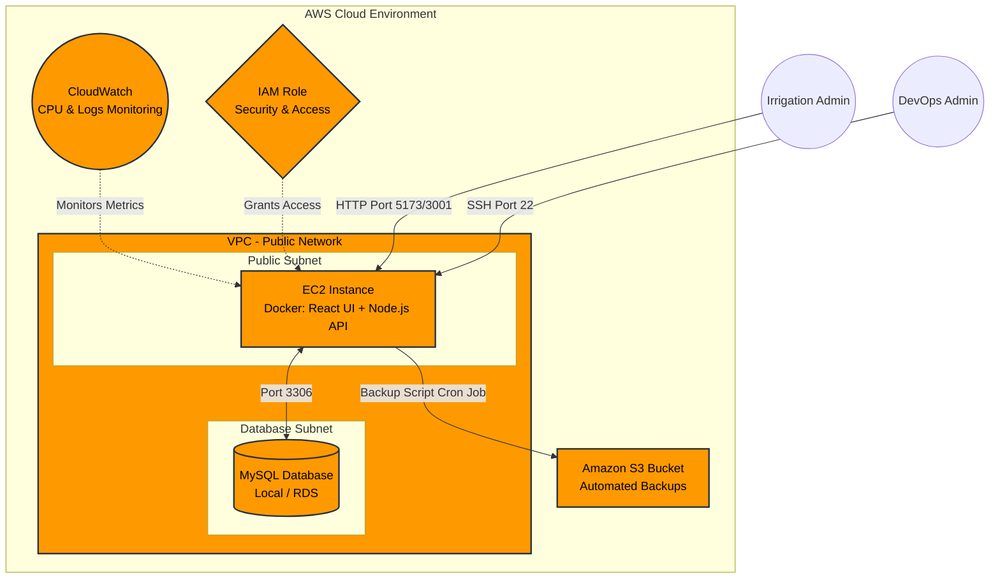

# AWS Cloud Engineering Case Study: Semester IV
**Institution:** ITM Skills University
**Program:** B.Tech CSE (2024–2028)
**Project Title:** IrrigaFlow Smart Irrigation Cloud
**Submitted By:** Piyush Solanki

---

## 1. Problem Statement & Objective
IrrigaFlow Smart Irrigation Cloud is experiencing rapid growth across multiple operational regions. Existing operations rely on disconnected systems, spreadsheets, and isolated environments. The objective of this project is to develop a centralized cloud platform capable of supporting operational management, analytics, monitoring, and future expansion. 

The implementation aligns with modern cloud deployment practices, security standards, and performance benchmarks specific to the Smart Irrigation & Water Conservation domain.

---

## 2. Cloud Architecture

The cloud architecture is designed for scalability, high availability, and secure access across AWS resources.

---

## 3. Implementation Details

### 3.1 Compute & Web Services (EC2)
- Deployed a scalable Amazon EC2 instance to host the primary web application.
- Secure SSH access configured using key pairs.

*(Insert EC2 Instance Screenshot Here)*  
`[Insert Screenshot: EC2 Dashboard showing running instance]`

### 3.2 Containerization (Docker)
- Fully containerized the frontend (React), backend (Node.js/Express), and database (MySQL) using Docker.
- Orchestrated the multi-container environment using `docker-compose`.

*(Insert Docker Screenshot Here)*  
`[Insert Screenshot: Terminal showing 'docker ps' with 3 running containers]`

### 3.3 Database & Storage (MySQL & S3)
- Implemented a structured MySQL database for operational records and analytics.
- Deployed an Amazon S3 Bucket for secure, highly durable cloud storage of system backups.

*(Insert S3 Screenshot Here)*  
`[Insert Screenshot: S3 Bucket list]`

### 3.4 Networking & Security (VPC & IAM)
- Utilized a Virtual Private Cloud (VPC) with a configured Public Subnet.
- Configured Security Groups to strictly control inbound/outbound traffic (Port 22, 80, 5173, 3001).
- Enforced role-based access control using AWS IAM roles/users to limit resource permissions.

*(Insert VPC & IAM Screenshots Here)*  
`[Insert Screenshot: VPC Route Table]`  
`[Insert Screenshot: IAM User/Role permissions]`

### 3.5 Monitoring & Resource Management (CloudWatch)
- Integrated Amazon CloudWatch to monitor instance CPU utilization, memory consumption, and application health.

*(Insert CloudWatch Screenshot Here)*  
`[Insert Screenshot: CloudWatch CPU Utilization Graph]`

### 3.6 Linux Administration & Automation
- Managed Linux user permissions and executed system package management.
- Developed shell scripts (`backup.sh`, `health-check.sh`, `start.sh`) to automate routine operations.
- Configured Linux `cron` jobs to trigger automated database backups.

*(Insert Linux Shell Screenshot Here)*  
`[Insert Screenshot: Terminal showing crontab -l and user permissions]`

---

## 4. Operational Dashboards

The application features a centralized React-based operational dashboard providing real-time visibility into all platform metrics, KPIs, and water usage records.

*(Insert Dashboard Screenshot Here)*  
`[Insert Screenshot: IrrigaFlow UI Dashboard showing Total Sites, Water Consumed, etc.]`

---

## 5. Disaster Recovery Strategy

To ensure high availability and prevent data loss during a critical failure, our Disaster Recovery strategy is built around strict RPO and RTO targets:

- **RPO (Recovery Point Objective) - Target: 24 Hours**
  - A Linux cron job (`backup.sh`) executes daily at 2:00 AM, automatically dumping the MySQL database and pushing the payload to an Amazon S3 Bucket (99.999999999% durability).
- **RTO (Recovery Time Objective) - Target: < 1 Hour**
  - The entire application stack is containerized. If the primary EC2 instance fails, a new instance can be provisioned rapidly by pulling the repository and running `docker-compose up`, restoring operations instantly.

---

## 6. Pricing Strategy & Cost Estimation

A comprehensive pricing model was developed for the cloud deployment, analyzing compute instances, storage, network bandwidth, and SLA monitoring tools.

### Infrastructure Optimization Recommendations:
1. **Reserved Instances:** Commit to 1-year or 3-year EC2 instances to reduce compute costs by up to 40%.
2. **Auto-Scaling:** Implement Auto-Scaling Groups to spin down resources during off-peak hours (nighttime irrigation downtime).
3. **S3 Lifecycle Policies:** Automatically transition older irrigation logs to S3 Glacier for cheaper long-term archival.

*(Insert Pricing Estimate Screenshot Here)*  
`[Insert Screenshot: IrrigaFlow UI Pricing Page showing the detailed AWS cost breakdown]`

---
*End of Report*
